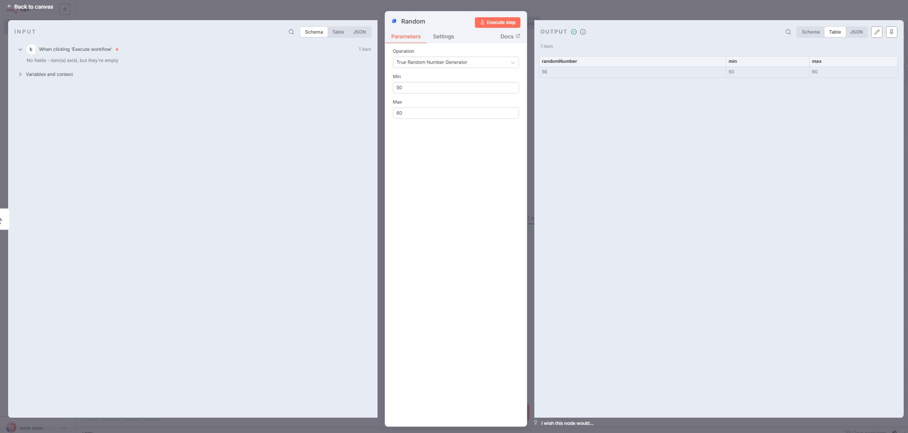
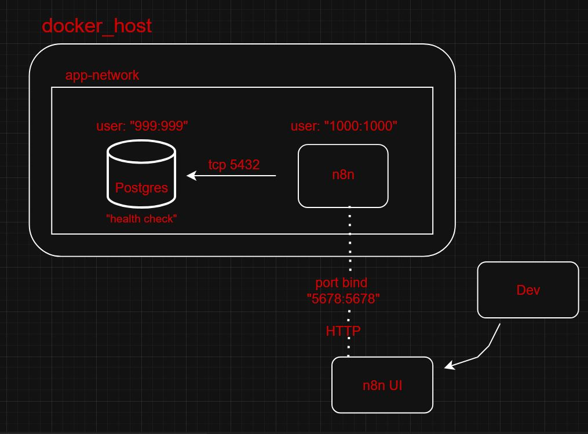

# n8n Random Number Generator - Custom Node

### Teste Técnico para Onfly



Um custom node profissional para n8n que gera números verdadeiramente aleatórios utilizando a API do Random.org. Desenvolvido seguindo as melhores práticas da documentação oficial do n8n com arquitetura programática completa.

## Sobre o Projeto

Este projeto implementa um conector personalizado que estende as capacidades do n8n, permitindo a geração de números aleatórios através da integração com a API pública do Random.org.

### Arquitetura
O diagrama abaixo ilustra a arquitetura do sistema implementado usando Docker, destacando a interação entre os serviços `Postgres` e `n8n`, bem como a conexão com o ambiente de desenvolvimento (`Dev`). A configuração foi orquestrada via `docker-compose.yml` e utiliza uma rede personalizada chamada `app-network`.




### Componentes e Conexões

1. **Docker Host**:
   - Representa o ambiente onde os contêineres Docker são executados.
   - Contém a rede `app-network`, que conecta os serviços internamente.

2. **Rede `app-network`**:
   - Uma rede do tipo `bridge` criada para facilitar a comunicação entre os contêineres.
   - Todos os serviços (`Postgres` e `n8n`) estão conectados a essa rede.

3. **Serviço `Postgres`**:
   - Imagem utilizada: `postgres:latest`.
   - Executa como usuário `999:999` para gerenciar permissões de arquivos e dados.
   - Expõe a porta `5432` para comunicação interna via TCP.
   - Armazena dados persistentes em um volume chamado `postgresdb` (`/var/lib/postgresql/data`).
   - Inclui um script de inicialização (`init-data.sh`) no diretório `/docker-entrypoint-initdb.d/`.
   - Possui um health check configurado com o comando `pg_isready` para verificar a disponibilidade do banco de dados a cada 5 segundos, com timeout de 10 segundos, 5 tentativas e um período inicial de 15 segundos.

4. **Serviço `n8n`**:
   - Imagem utilizada: `n8nio/n8n:latest`.
   - Executa como usuário `1000:1000` para gerenciar permissões de arquivos e dados.
   - Conecta-se ao `Postgres` usando o host `postgres` na porta `5432`, configurado via variáveis de ambiente (`DB_TYPE=postgresdb`, `DB_POSTGRESDB_HOST=postgres`, etc.).
   - Expõe a porta `5678` para acesso externo, mapeada como `5678:5678` no host.
   - Armazena dados persistentes em um volume chamado `n8n_data` (`/home/node/.n8n`).
   - Inclui um diretório customizado (`./.n8n/custom`) montado como read-only.
   - Depende do health check do `Postgres` para iniciar somente após o banco estar saudável.

5. **Ambiente `Dev`**:
   - Representa o ambiente de desenvolvimento que interage com o sistema.
   - Acessa a interface do `n8n` via HTTP na porta `5678` do host.
   - A conexão é facilitada pelo mapeamento de porta `5678:5678`.

6. **Interface `n8n UI`**:
   - Interface gráfica do `n8n`, acessível pelo ambiente `Dev` após a conexão HTTP na porta `5678`.
   - Permite a interação com os fluxos de automação configurados no `n8n`.

### Fluxo de Comunicação
- O `Postgres` fornece um banco de dados relacional acessível via `tcp 5432` para o `n8n`.
- O `n8n` utiliza o `Postgres` como backend de dados e expõe sua interface via porta `5678`.
- O ambiente `Dev` se conecta à interface `n8n UI` através do bind de porta `5678:5678`, permitindo o gerenciamento e monitoramento dos workflows.

### Notas Adicionais
- Os usuários `999:999` (Postgres) e `1000:1000` (n8n) foram configurados para garantir segurança devido ao problema de segurança do compartilhamento do kernel entre o docker e o host. 
- A rede `app-network` assegura uma comunicação eficiente e isolada entre os serviços.


### Características Principais:

- **Integração Real**: Utiliza API externa do Random.org
- **Configurável**: Parâmetros Min/Max personalizáveis
- **Profissional**: Interface limpa com operação única
- **Robusto**: Tratamento completo de erros
- **Visual**: Ícone SVG personalizado (dado isométrico animado)
- **Infraestrutura**: Docker Compose + PostgreSQL
- **Documentado**: README completo e código comentado

## Stack Tecnológica

| Tecnologia | Versão | Propósito |
|------------|--------|-----------|
| **Node.js** | 22 (LTS) | Runtime JavaScript |
| **TypeScript** | 5.2+ | Desenvolvimento type-safe |
| **n8n** | Latest | Plataforma de automação |
| **PostgreSQL** | Latest | Banco de dados |
| **Docker** | Latest | Containerização |
| **Docker Compose** | v3.8 | Orquestração |

## Arquitetura de arquivos do Projeto

```
n8n-random-project/
├── 📄 package.json                    # Configuração do projeto
├── 📄 docker-compose.yml              # Orquestração Docker
├── 📄 .env                            # Variáveis de ambiente
├── 📄 .env.example                    # Template de configuração
├── 📄 .gitignore                      # Arquivos ignorados
├── 📄 README.md                       # Esta documentação
├── 📁 docs/                           # Pasta para documentação
│   └── 📁 images                      # Para guardar imagens relacionadas a documentação    
├── 📁 init-db/                        # Scripts de inicialização
│   └── 📄 init-data.sh                # Setup usuário PostgreSQL
└── 📁 .n8n/                          # Configurações n8n
    └── 📁 custom/                     # Custom nodes
        └── 📁 n8n-nodes-random/       # Nosso custom node
            ├── 📄 package.json        # Config do node
            ├── 📄 tsconfig.json       # Config TypeScript
            ├── 📁 nodes/              # Código fonte
            │   ├── 📄 Random.node.ts  # Implementação principal
            │   └── 🎨 Random.svg      # Ícone do node
            └── 📁 dist/               # Código compilado
                └── 📁 nodes/          # JS + assets
                    ├── 📄 Random.node.js
                    └── 🎨 Random.svg
```

## Executar os Testes

Este projeto não possui testes automatizados.  
O processo de teste consiste em validar manualmente o funcionamento do conector personalizado no ambiente n8n local.
Para isso, garanta que os seguintes passos sejam realizados de forma correta e sequencial.

##  Instalação e Configuração Detalhada

### Pré-requisitos

- **Node.js 22** (LTS)
- **Docker** e **Docker Compose**
- **Git** para clonagem do repositório


### Verificar pré-requisitos
```bash
node --version    # Deve ser v22.x.x
docker --version  # Qualquer versão recente
git --version     # Para clonagem
```

### Instalação

```bash
# 1. Clone e acesse
git clone https://github.com/rafaelabras/desafio-estagio-onfly.git
cd desafio-estagio-onfly

# 2. Configure ambiente
cp .env.example .env
# Edite o .env com suas preferências
# Caso o cp não funcione, apenas copie o .env.example e nomeie para apenas .env e configure as ENVs presentes com valores desejados.

# 3. Instale e build
npm install
cd .n8n/custom/n8n-nodes-random
npm install 
npm run build
cd ../../..

# 4. Execute
npm run dev
```

### Verificação Rápida
1. Acesse: http://localhost:5678
2. Configure conta admin
3. Procure pelo node **Random** na lista de nodes (em “Action in an app”)  
4. Teste com Min: 1, Max: 60

**Pronto!** Seu ambiente está funcional.

### 1. Clone o Repositório

```bash
git clone https://github.com/seu-usuario/n8n-random-project.git
cd n8n-random-project
```

### 2. Configure o Ambiente

```bash
# Copie o arquivo de exemplo
cp .env.example .env

# Edite as variáveis (use um editor de texto)
nano .env
```

Configuração do `.env`:
```env
# Configurações PostgreSQL
POSTGRES_DB=n8n_db
POSTGRES_USER=postgres
POSTGRES_PASSWORD=sua_senha_segura_123
POSTGRES_NON_ROOT_USER=n8n_user
POSTGRES_NON_ROOT_PASSWORD=n8n_senha_123

# Configurações n8n
N8N_ENCRYPTION_KEY=sua_chave_encriptacao_minimo_10_chars
```

### 3. Instale as Dependências

```bash
# Dependências do projeto principal
npm install

# Dependências do custom node
cd .n8n/custom/n8n-nodes-random
npm install

# Aplicar correções de segurança (recomendado porém tenha cuidado)
npm audit fix --force
cd ../../..
```

### 4. Build do Custom Node

```bash
npm run build-node
```

### 5. Execute o Ambiente

```bash
# Desenvolvimento (com logs detalhados)
npm run dev

# Ou produção
npm start
```

### 6. Primeiro Acesso

1. Acesse: **http://localhost:5678**
2. Configure sua conta de administrador
3. Procure pelo node **Random** na lista de nodes (em “Action in an app”)  

## Utilizando o Custom Node

### Interface do Node

O custom node apresenta uma interface limpa e intuitiva:

1. **Operation**: "True Random Number Generator" (única opção)
2. **Min**: Valor mínimo (inclusivo) - padrão: 1
3. **Max**: Valor máximo (inclusivo) - padrão: 60

### Exemplo de Workflow

1. **Adicione um trigger** (Manual Trigger, Webhook, etc.)
2. **Arraste o node "Random"** para o canvas
3. **Configure os parâmetros**:
   - Min: `1`
   - Max: `60`
4. **Execute o workflow**

### Saída Esperada

```json
{
  "randomNumber": 42,
  "min": 1,
  "max": 60
}
```

##  Comandos Disponíveis

```bash
# Desenvolvimento
npm run dev                 # Inicia ambiente completo
npm run build-node         # Recompila apenas o custom node
npm start                  # Modo produção
npm stop                   # Para os containers
npm run clean              # Remove volumes e dados

# Debugging
docker-compose logs n8n    # Logs do n8n
docker-compose logs postgres # Logs do PostgreSQL
docker-compose ps          # Status dos containers
```

##  Desenvolvimento e Customização

### Estrutura do Custom Node

O custom node utiliza scripts cross-platform para garantir compatibilidade entre sistemas operacionais:

```json
{
  "scripts": {
    "build": "tsc && npm run copy-icons",
    "copy-icons": "cpy 'nodes/*.svg' dist/nodes",
    "dev": "tsc --watch",
    "clean": "rimraf dist"
  },
  "devDependencies": {
    "cpy-cli": "^6.0.0",
    "rimraf": "^6.0.1"
  }
}
```

**Ferramentas cross-platform utilizadas:**
- `cpy-cli`: Copia arquivos SVG de forma compatível com Windows/Linux/Mac
- `rimraf`: Remove diretórios de forma cross-platform
- `tsc`: Compilador TypeScript nativo

```typescript
export class Random implements INodeType {
    description: INodeTypeDescription = {
        displayName: 'Random',
        name: 'random',
        icon: 'file:Random.svg',
        group: ['transform'],
        version: 1,
        // ... configurações
    };

    async execute(this: IExecuteFunctions): Promise<INodeExecutionData[][]> {
        // Lógica de execução
    }
}
```

##  Monitoramento e Logs

### Logs Importantes

```bash
# Verificar carregamento do custom node
docker-compose logs n8n | grep -i custom

# Verificar erros específicos
docker-compose logs n8n | grep -i error

# Monitoramento em tempo real
docker-compose logs -f n8n
```

### Health Checks

O ambiente possui health checks automáticos:

- **PostgreSQL**: Verificação a cada 5s
- **n8n**: Dependente do PostgreSQL healthy

### Métricas

```bash
# Uso de recursos
docker stats

# Verificar conectividade do banco
docker-compose exec postgres psql -U n8n_user -d n8n_db -c "SELECT version();"

# Teste da API Random.org
curl "https://www.random.org/integers/?num=1&min=1&max=100&col=1&base=10&format=plain&rnd=new"
```

## Segurança e Boas Práticas

### Segurança Implementada

-  **Credenciais**: Não commitadas no repositório
-  **Usuário BD**: Usuário específico com permissões limitadas
-  **Networks**: Comunicação isolada entre containers
-  **Validação**: Input sanitization nos parâmetros
-  **Errors**: Tratamento seguro de erros

## Troubleshooting

### Problemas Comuns

| Problema | Sintoma | Solução |
|----------|---------|---------|
| **Node não aparece** | Não encontrado na busca | `npm run build-node && docker-compose restart n8n` |
| **Erro de conexão DB** | `password authentication failed` | Verificar `.env` e executar `init-data.sh` |
| **API Random.org** | `request failed` | Verificar conectividade e rate limit |
| **Build falha** | Erros TypeScript | Verificar versões das dependências |

### Logs de Debug

```bash
# Mode debug completo
docker-compose down
docker-compose -f docker-compose.yml -f docker-compose.debug.yml up
```

### Reset Completo

```bash
# Limpar tudo e recomeçar
docker-compose down -v
docker system prune -f
rm -rf .n8n/config
npm run build-node
docker-compose up
```

### Padrões de Commit

Utilizamos [Conventional Commits](https://conventionalcommits.org/):

```
feat: nova funcionalidade
fix: correção de bug
docs: atualização de documentação
style: formatação de código
refactor: refatoração
test: adição de testes
chore: configurações e build
```

## Créditos

**Desenvolvido por:** Rafael Abras  
**Tecnologias:** n8n, Node.js, TypeScript, Docker, PostgreSQL  
**API:** Random.org para geração de números aleatórios

---

##  Suporte

Para dúvidas, sugestões ou problemas:

- **Issues**: [GitHub Issues](https://github.com/rafaelabras/desafio-estagio-onfly/issues)
- **Documentação n8n**: [docs.n8n.io](https://docs.n8n.io)

---
